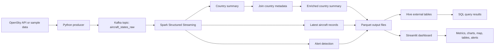

# Flight Tracking Analytics Implementation

This folder contains the implementation for the real-time flight tracking analytics project.

## Folder Structure

- `producer/` - Python producer that polls OpenSky and writes aircraft records to Kafka.
- `kafka/` - Kafka topic setup commands and notes.
- `spark/` - PySpark Structured Streaming job.
- `hive/` - Hive database and table setup scripts.
- `dashboard/` - Streamlit dashboard.
- `data/static/` - Static enrichment datasets for the Spark SQL bonus join.
- `data/sample/` - Backup sample data for local testing and demo fallback.
- `docs/` - Demo notes, screenshots, and project documentation.
- `checkpoints/` - Spark streaming checkpoint directories.

## Local Python Setup

From the project root:

```powershell
.\.venv\Scripts\Activate.ps1
python -m pip install -r requirements.txt
```

Copy the environment template before running the app:

```powershell
Copy-Item flight_tracking\.env.example flight_tracking\.env
```

Then update `flight_tracking/.env` with any OpenSky token or local configuration values.

## Docker Infrastructure

Start the infrastructure services from the project root:

```powershell
docker compose up -d
```

Useful service URLs:

- Kafka UI: `http://localhost:8080`
- Spark master UI: `http://localhost:8081`
- Spark worker UI: `http://localhost:8082`
- HDFS NameNode UI: `http://localhost:9870`
- HiveServer2 UI: `http://localhost:10002`

Kafka is available from local Python code at:

```text
localhost:9092
```

Kafka is available from other Docker containers at:

```text
kafka:29092
```

Stop services:

```powershell
docker compose down
```

## High-Level Pipeline

```text
OpenSky API
    -> Python Kafka producer
    -> Kafka topic: aircraft_states_raw
    -> Spark Structured Streaming
    -> Hive tables
    -> Streamlit dashboard
```



## Step 2: Test OpenSky API

From the project root:

```powershell
.\.venv\Scripts\python.exe flight_tracking\producer\test_opensky_api.py --limit 25
```

The script writes sample data to:

- `flight_tracking/data/sample/opensky_raw_sample.json`
- `flight_tracking/data/sample/opensky_normalized_sample.jsonl`

## Step 3: Run Producer

Publish one OpenSky poll to Kafka:

```powershell
.\.venv\Scripts\python.exe flight_tracking\producer\opensky_producer.py --once --max-records 25
```

Run the producer continuously:

```powershell
.\.venv\Scripts\python.exe flight_tracking\producer\opensky_producer.py
```

Check the topic in Kafka UI:

```text
http://localhost:8080
```

## Step 4: Spark Kafka Parser

Run Spark from the Docker Spark container:

```powershell
docker exec flight-spark-master /opt/spark/bin/spark-submit --packages org.apache.spark:spark-sql-kafka-0-10_2.12:3.5.5 /workspace/flight_tracking/spark/flight_streaming_job.py --mode console --trigger-once --bootstrap-servers kafka:29092 --checkpoint-dir /tmp/flight_tracking/checkpoints/console_parser
```

This consumes `aircraft_states_raw`, parses JSON, and prints aircraft records.

## Step 5: Spark Analytics

Country-level summaries:

```powershell
docker exec flight-spark-master /opt/spark/bin/spark-submit --packages org.apache.spark:spark-sql-kafka-0-10_2.12:3.5.5 /workspace/flight_tracking/spark/flight_streaming_job.py --mode country-summary --trigger-once --bootstrap-servers kafka:29092 --checkpoint-dir /tmp/flight_tracking/checkpoints/country_summary_batch --output-path /workspace/flight_tracking/output
```

Alert detection:

```powershell
docker exec flight-spark-master /opt/spark/bin/spark-submit --packages org.apache.spark:spark-sql-kafka-0-10_2.12:3.5.5 /workspace/flight_tracking/spark/flight_streaming_job.py --mode alerts --trigger-once --bootstrap-servers kafka:29092 --checkpoint-dir /tmp/flight_tracking/checkpoints/alerts --output-path /workspace/flight_tracking/output
```

## Step 6: Hive Tables

Create external Hive tables over the processed Parquet outputs:

```powershell
docker exec flight-hive beeline -u jdbc:hive2://localhost:10000 -f /workspace/flight_tracking/hive/create_tables.sql
```

Query the country summary table:

```powershell
docker exec flight-hive beeline -u jdbc:hive2://localhost:10000 -e "SELECT origin_country, aircraft_count, ROUND(avg_velocity_mps, 2) FROM flight_tracking.aircraft_country_summary ORDER BY aircraft_count DESC LIMIT 10;"
```

## Step 7: Bonus Static Dataset Join

This is a bonus feature in the project. Spark does not only aggregate the live aircraft stream; it also enriches the streaming result with a static country metadata dataset. This adds `region` and `continent` to the country-level analytics.

The key function is `build_enriched_country_summary_batch` in `spark/flight_streaming_job.py`:

```python
def build_enriched_country_summary_batch(batch_df, country_metadata_path):
    batch_spark = batch_df.sparkSession
    summary_df = build_country_summary_batch(batch_df)
    metadata_df = (
        batch_spark.read.option("header", "true")
        .option("inferSchema", "true")
        .csv(country_metadata_path)
    )

    summary_df.createOrReplaceTempView("country_summary_batch")
    metadata_df.createOrReplaceTempView("country_metadata")

    return batch_spark.sql(
        """
        SELECT
          s.window_start,
          s.window_end,
          s.origin_country,
          COALESCE(m.region, 'Unknown') AS region,
          COALESCE(m.continent, 'Unknown') AS continent,
          s.aircraft_count,
          s.avg_baro_altitude_m,
          s.avg_geo_altitude_m,
          s.avg_velocity_mps,
          s.max_velocity_mps,
          s.min_baro_altitude_m,
          s.processed_at
        FROM country_summary_batch s
        LEFT JOIN country_metadata m
          ON s.origin_country = m.country
        """
    )
```

What this bonus step does:

- Builds the normal country summary from Kafka aircraft records.
- Reads `country_metadata.csv` as a static reference dataset.
- Creates temporary Spark SQL views for both datasets.
- Runs a SQL `LEFT JOIN` between live summary data and static metadata.
- Adds `region` and `continent` columns.
- Uses `COALESCE` so missing metadata becomes `Unknown` instead of null.

Example enriched output:

```text
origin_country   region           continent       aircraft_count
United States    North America    North America   40
Germany          Western Europe   Europe          8
Unknown Country  Unknown          Unknown         1
```

Upload country metadata to HDFS:

```powershell
docker exec flight-hdfs-namenode hdfs dfs -mkdir -p /flight_tracking/static
docker cp flight_tracking/data/static/country_metadata.csv flight-hdfs-namenode:/tmp/country_metadata.csv
docker exec flight-hdfs-namenode hdfs dfs -put -f /tmp/country_metadata.csv /flight_tracking/static/country_metadata.csv
```

Run the enriched Spark SQL join:

```powershell
docker exec flight-spark-master /opt/spark/bin/spark-submit --packages org.apache.spark:spark-sql-kafka-0-10_2.12:3.5.5 /workspace/flight_tracking/spark/flight_streaming_job.py --mode country-summary-enriched --trigger-once --bootstrap-servers kafka:29092 --checkpoint-dir /tmp/flight_tracking/checkpoints/country_summary_enriched --output-path /workspace/flight_tracking/output --country-metadata-path hdfs://namenode:9000/flight_tracking/static/country_metadata.csv
```

Query the enriched Hive table:

```powershell
docker exec flight-hive beeline -u jdbc:hive2://localhost:10000 -e "SELECT origin_country, region, continent, aircraft_count FROM flight_tracking.aircraft_country_summary_enriched ORDER BY aircraft_count DESC LIMIT 10;"
```

## Step 7b: Detailed Aircraft Output

Write detailed latest aircraft records for the map and aircraft detail tabs:

```powershell
docker exec flight-spark-master /opt/spark/bin/spark-submit --packages org.apache.spark:spark-sql-kafka-0-10_2.12:3.5.5 /workspace/flight_tracking/spark/flight_streaming_job.py --mode latest-aircraft --trigger-once --bootstrap-servers kafka:29092 --checkpoint-dir /tmp/flight_tracking/checkpoints/latest_aircraft --output-path /workspace/flight_tracking/output
```

For a reliable recorded demo, replay the saved OpenSky sample instead of depending on the live API:

```powershell
.\.venv\Scripts\python.exe flight_tracking\producer\replay_sample_producer.py --loop --delay 0.25
```

## Step 8: Streamlit Dashboard

Run the dashboard from the project root:

```powershell
.\.venv\Scripts\streamlit.exe run flight_tracking\dashboard\flight_dashboard.py
```

The dashboard reads the same processed Parquet outputs used by Hive:

- `flight_tracking/output/country_summary_enriched`
- `flight_tracking/output/latest_aircraft`
- `flight_tracking/output/alerts`

See `flight_tracking/docs/demo_runbook.md` for a full recording checklist.
